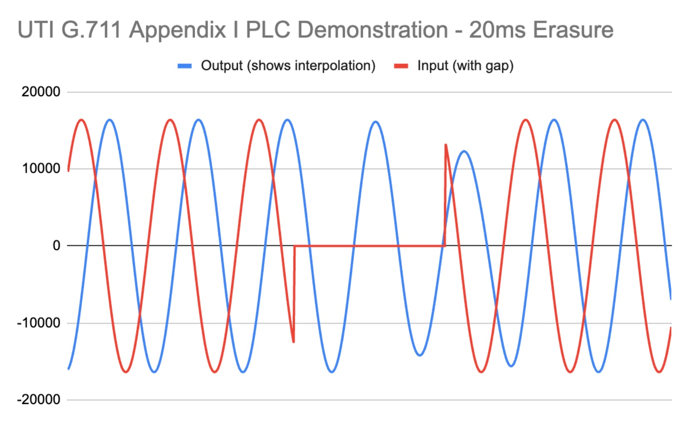

This repo contains two implementations described in ITU G.711.

* A uLaw CODEC
* A packet loss concealment (PLC) utility

G.711 CODEC Overview
====================

This is a bare-bones implementation of an ITU G.711 uLaw 
encoder/decoder. This can be used in embedded implementations.
**There is no use of dynamic memory allocation in this code.**

The encode function converts a 16-bit PCM value to an 8-bit value. The
decode function goes the other way. 

The A-Law CODEC has not been implemented yet.

## References

* [Summary of the CODEC](https://en.wikipedia.org/wiki/G.711)
* [Official ITU standard document](https://www.itu.int/rec/dologin_pub.asp?lang=e&id=T-REC-G.711-198811-I!!PDF-E&type=items)
* [Online file converter](https://g711.org/) that understands
G.711 files.

G.711 Packet Loss Concealment Utility (PLC)
===========================================

This is more complicated than the CODEC. Packet Loss Concealment
systems are intended to
improve the quality of digital/packetized voice applications by
"smoothing over" playout gaps created by missing/late/out-of-order
network packets. The G.711 standard is a fairly simple
time-domain algorithm.

The implementation is hard-coded to work on 16-bit PCM audio 
sampled at 8 kHz with a 10ms (80 sample) frame size. This is
easily used in 20ms frame systems by calling the goodFrame()
and badFrame() functions twice for each 20ms audio frame.

This would be a good fit for 8 kHz applications like EchoLink or [AllStarLink](https://www.allstarlink.org/).

The picture below illustrates the basic idea. The red trace is the 
input signal with a 20ms gap in the middle. The blue trace is
the interpolated output. Notice that the blue trace matches
the frequency and phase of the red trace even during the drop-out.



The blue trace lags the red trace by about 4ms. This is the
inherent delay of the G.711 PLC algorithm.

Obviously this is a contrived example and things are more 
complicated using real voice.

This code is embedded-friendly. **There is no use of dynamic memory allocation anywhere in the code.** 

There is work in process to eliminate much of the floating-point
math in this code.

## References

* [Overview of the problem being solved](https://en.wikipedia.org/wiki/Packet_loss_concealment)
* [Official ITU Standard Document](https://www.itu.int/rec/dologin_pub.asp?lang=e&id=T-REC-G.711-199909-I!AppI!PDF-E&type=items)
* [This is an Amazon paper](https://assets.amazon.science/41/c1/5650d1214f919a168f4b6c1ddfec/real-time-packet-loss-concealment-with-mixed-generative-and-predictive-model.pdf) that talks about a much more sophisticated algorithm. However,
the introduction gives a lot of good background on how these systems
work.

## Example Code

```c++
#include <iostream>
#include <cstdint>
#include <cmath>

#include "itu-g711-plc/Plc.h"

using namespace std;
using namespace kc1fsz;

int main(int,const char**) {

    // Instantiate the PLC. There is state maintained
    // between calls.
    Plc plc;

    float sampleRate = 8000;
    float f = 85;
    float omega = 2 * 3.14156 * f / sampleRate;
    float phi = 0;

    unsigned frameCount = 12;
    const unsigned frameLen = 80;

    for (unsigned j = 0; j < frameCount; j++) {

        int16_t inFrame[frameLen];
        int16_t outFrame[frameLen];

        // Put a tone into the input frame from demonstration
        for (unsigned i = 0; i < frameLen; i++) {
            inFrame[i] = 0.5 * 32767.0f * std::cos(phi);
            phi += omega;
        }

        // Here is where the PLC gets applied. Call
        // goodFrame() for a valid frame. Call badFrame()
        // when a frame is missing. In either case you'll
        // get an output frame that can sent along the 
        // audio pipeline.

        // Create a few erasures to demonstrate interpolation
        if (j == 4 || j == 5 || j >= 8)
            plc.badFrame(outFrame, frameLen);
        // Otherwise feed good audio 
        else
            plc.goodFrame(inFrame, outFrame, frameLen);

        // For display
        for (unsigned i = 0; i < frameLen; i++) 
            cout << inFrame[i] << "\t" << outFrame[i] << endl;
    }
}
```


